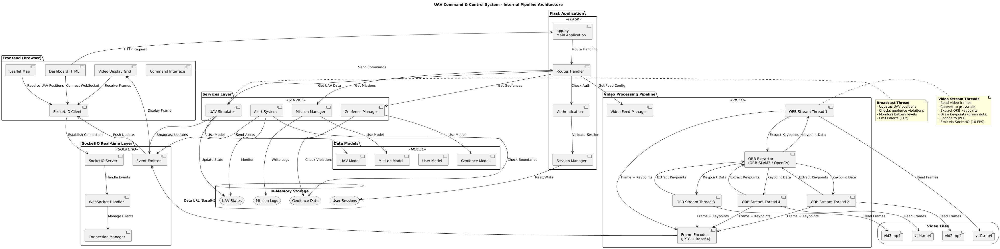

# CENTRAL-UAV-DASHBOARD-vc

A simulated centralized dashboard for visualizing UAV telemetry data and monitoring multiple drone units through a web interface.

## Overview

This project provides a web-based simulation dashboard that displays synthetic telemetry data for multiple UAV units. No physical hardware is required; all data is generated programmatically to demonstrate UAV fleet monitoring capabilities.

The system is designed for testing, development, and demonstration of multi-UAV control interfaces without actual drone hardware.

## Mind Maps

Project architecture and workflow visualizations:




## Features

- Simulated real-time telemetry generation
- Multi-UAV visualization
- Interactive dashboard interface
- GPS position simulation
- Battery and sensor data display
- Flight status indicators
- WebSocket-based live updates

## Requirements

### Software
- Python 3.8+
- Modern web browser (Chrome, Firefox recommended)

### Python Dependencies
```bash
pip install flask flask-socketio numpy
```

## Setup

1. Clone the repository:
```bash
git clone https://github.com/Disract/CENTRAL-UAV-DASHBOARD-vc.git
cd CENTRAL-UAV-DASHBOARD-vc
```

2. Install dependencies:
```bash
pip install -r requirements.txt
```

3. Run the dashboard server:
```bash
python app.py
```

4. Open browser and navigate to `http://localhost:5000`

## Project Structure
```
CENTRAL-UAV-DASHBOARD-vc/
├── app.py                  # Main Flask application
├── static/                 # CSS, JavaScript, assets
│   ├── js/                # Frontend scripts
│   └── css/               # Stylesheets
├── templates/             # HTML templates
├── simulator.py           # Telemetry data generator
├── mindmap1.png           # Project mind map
├── mindmap2.png           # Workflow diagram
├── architecture.png       # System architecture
└── requirements.txt       # Python dependencies
```

## Functionality

### Simulated Telemetry Data
- GPS coordinates (latitude, longitude, altitude)
- Battery voltage and percentage
- Flight mode status
- Heading and orientation angles
- Ground speed and airspeed
- Armed/disarmed state
- System health indicators

### Dashboard Interface
- Real-time data visualization
- Multi-UAV status panels
- Interactive map display
- Telemetry graphs and charts
- Alert and warning indicators

### Simulation Controls
- Start/stop simulation
- Add/remove virtual UAVs
- Adjust update frequency
- Randomize flight patterns

## Usage

1. Start the simulation server
2. Access the web dashboard at `http://localhost:5000`
3. View simulated telemetry for multiple UAVs
4. Monitor real-time data updates
5. Interact with visualization controls

## Data Generation

The simulator generates realistic telemetry values:
- GPS positions follow randomized flight paths
- Battery levels decrease over time
- Flight modes change based on mission profiles
- Sensor data includes realistic noise and variation

All data is synthetic and does not require hardware connections.

## Configuration

Customize simulation parameters in `config.py`:
- Number of simulated UAVs
- Update frequency (Hz)
- Flight area boundaries
- Telemetry value ranges
- Mission profiles

## Visualization

- WebSocket for real-time updates
- JSON data format for telemetry
- Chart.js for graphing
- Leaflet or OpenLayers for map display

## Limitations

- No actual hardware integration
- No real flight control capabilities
- Data is purely simulated
- Not suitable for actual UAV operations
- Educational and demonstration purposes only

## Use Cases

- Dashboard UI/UX development
- Multi-UAV interface prototyping
- Telemetry visualization testing
- Training and education
- Software development without hardware dependency

## Notes

- Simulation runs independently of real drones
- Telemetry patterns can be customized
- No radio communication modules required
- Safe for testing control logic without flight risk

## License

Specify a license before redistribution.
